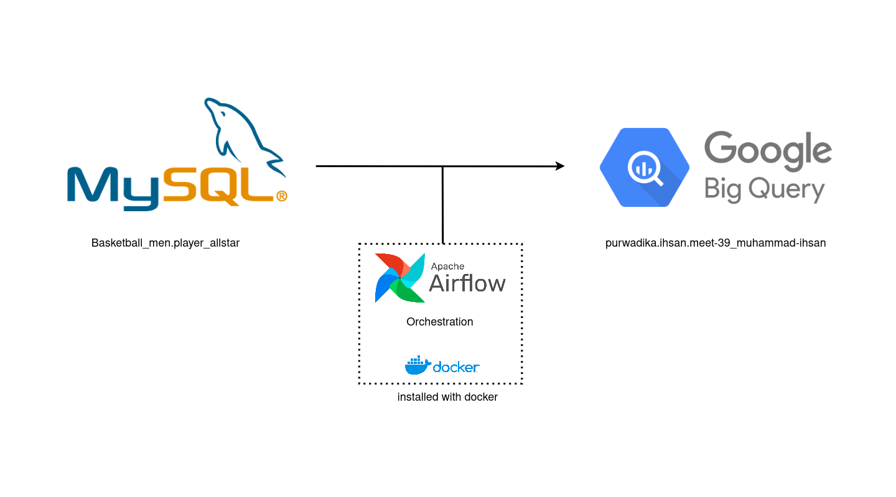

**Ingesting MySQL data and loading it to BigQuery**

This is a repository for an Exercise from my data Engineering Bootcamp from Purwadhika.

I have been tasked to ingest data from an open [database](https://relational-data.org/dataset/BasketballMen) and to load it to bigquery. The data is about players of NBA All-Stars on 1985. Due to how fun it's to work on this I want to put it on git for everyone to see what i've learned.

Current issue that I have, is that at first I want to load allstars from 1981 to 1985, but the task keep failing. Currently I don't know if it's due to my slow laptop or it's due to the xcom cannot store large dataset. 

Any comments or suggestion are welcomed, contact me at: muhihsan0@outlook.com. thank you!
